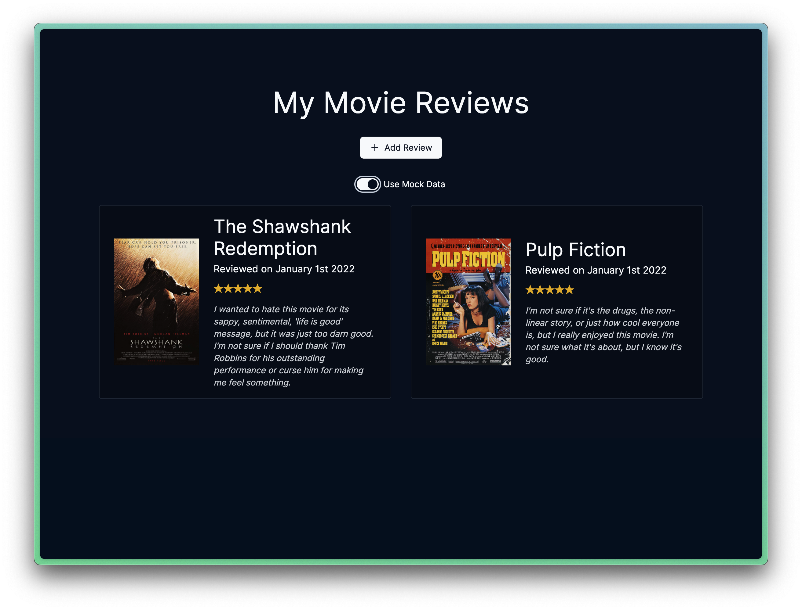
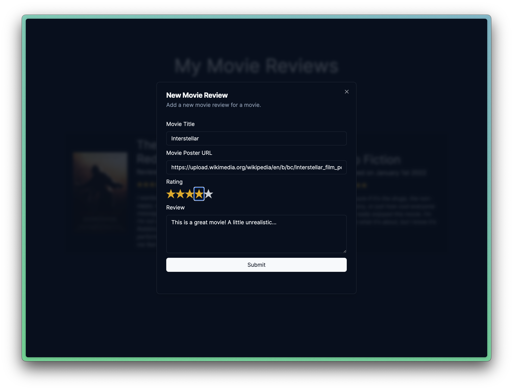

# Movie Reviews Sample App

 

This is an open source tutorial on how to use Codeium to implement MongoDB into an application (< 5 minutes). This application:

* Stores user contributed movie reviews in MongoDB.
* Queries the movie reviews from MongoDB and displays them on the homepage.

The full tutorial will be posted on YouTube shortly so that others may follow along.

## Screenshots

